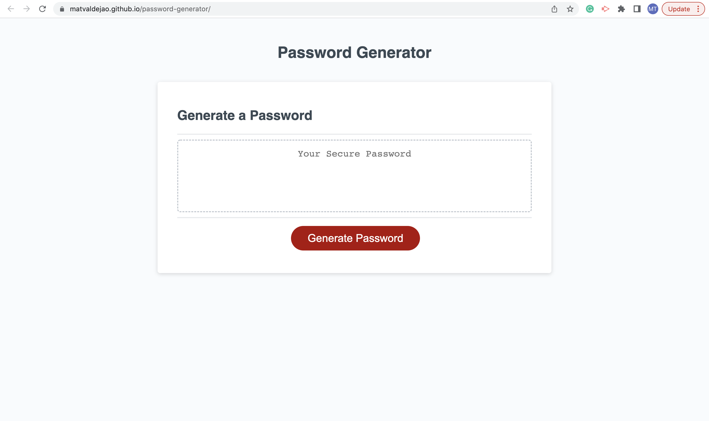

# Password-Generator

## Purpose
The purpose of this website is to generate a password according to the specifications of the user. Once arriving at the page, the user is asked a series of prompts and confirms where they select the parameters that they want to implement in their password. Using the answers as specifications of the user, the system randomly generates a password containing those same specifications.

## User Specifications
The user can specify five criteria to be included into the password:
 * Password length
 * Whether it contains lowercase characters
 * Whether it contains uppercase characters
 * Whether it contains numeric characters
 * Whether it contains special characters

The user is not allowed to choose passwords below 8 characters long (design choice to produce safe passwords) or longer than 128 characters. Furthermore, the user is required to choose at least one of the 4 character types as choosing none wouldn't produce a usable passsword. 

## Built With 
 * HTML
 * CSS
 * JavaScript

 ## Website
 https://matvaldejao.github.io/password-generator/

 ## Website Screenshot
 
